# Design Patterns Class Diagrams

*Complete UML class diagrams for all 16 design patterns implemented in this project*

---

## Table of Contents

1. [Singleton Pattern](#1-singleton-pattern)
2. [Factory Method Pattern](#2-factory-method-pattern)
3. [Abstract Factory Pattern](#3-abstract-factory-pattern)
4. [Builder Pattern](#4-builder-pattern)
5. [Adapter Pattern](#5-adapter-pattern)
6. [Command Pattern](#6-command-pattern)
7. [Decorator Pattern](#7-decorator-pattern)
8. [Strategy Pattern](#8-strategy-pattern)
9. [Observer Pattern](#9-observer-pattern)
10. [Facade Pattern](#10-facade-pattern)
11. [Repository Pattern](#11-repository-pattern)
12. [Mediator Pattern](#12-mediator-pattern)
13. [State Pattern](#13-state-pattern)
14. [Prototype Pattern](#14-prototype-pattern)
15. [Chain of Responsibility Pattern](#15-chain-of-responsibility-pattern)
16. [Strategy Advanced Pattern](#16-strategy-advanced-pattern)

---

## 1. Singleton Pattern

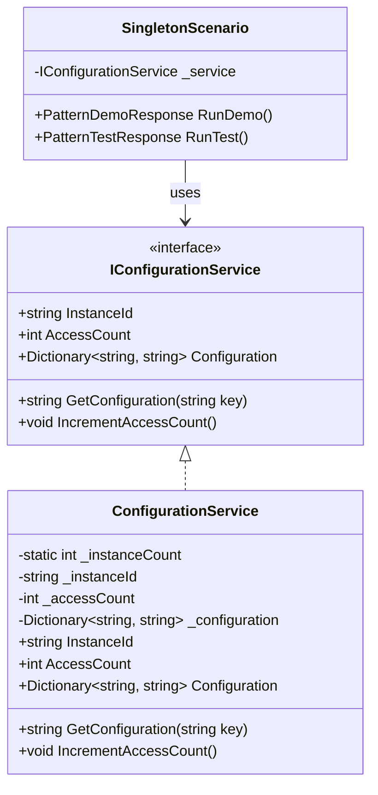

**Key Relationships:**
- `ConfigurationService` implements `IConfigurationService`
- `SingletonScenario` depends on `IConfigurationService`
- DI container creates single instance via `AddSingleton<>()`

---

## 2. Factory Method Pattern

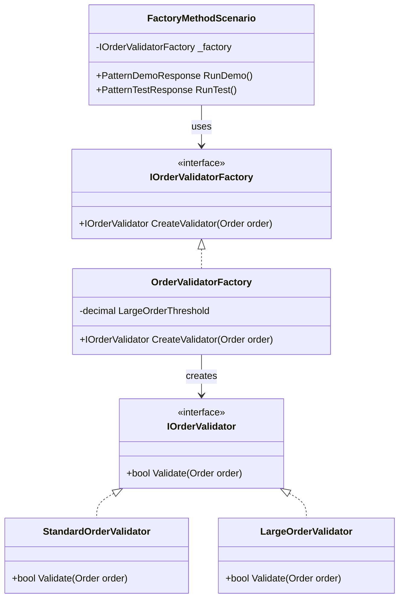

**Key Relationships:**
- `OrderValidatorFactory` implements `IOrderValidatorFactory`
- Factory creates different validators based on order characteristics
- All validators implement `IOrderValidator` interface

---

## 3. Abstract Factory Pattern

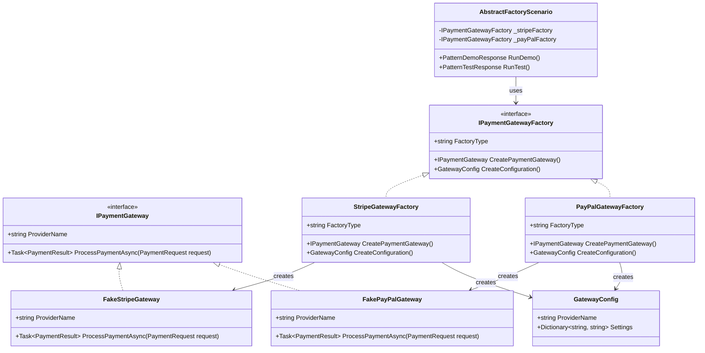

**Key Relationships:**
- Each factory creates a family of related objects (gateway + config)
- `StripeGatewayFactory` creates `FakeStripeGateway` and `StripeConfig`
- `PayPalGatewayFactory` creates `FakePayPalGateway` and `PayPalConfig`
- Products from same factory are guaranteed compatible

---

## 4. Builder Pattern

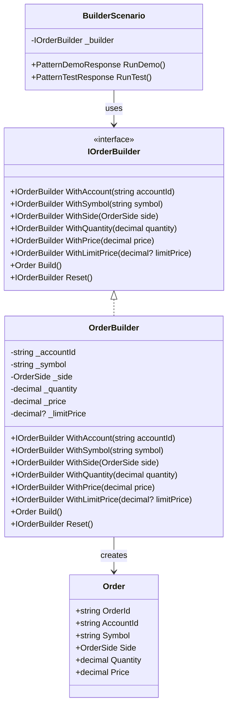

**Key Relationships:**
- `OrderBuilder` implements `IOrderBuilder` for fluent interface
- Methods return `IOrderBuilder` for method chaining
- `Build()` validates and creates final `Order` object
- `Reset()` clears builder state for reuse

---

## 5. Adapter Pattern

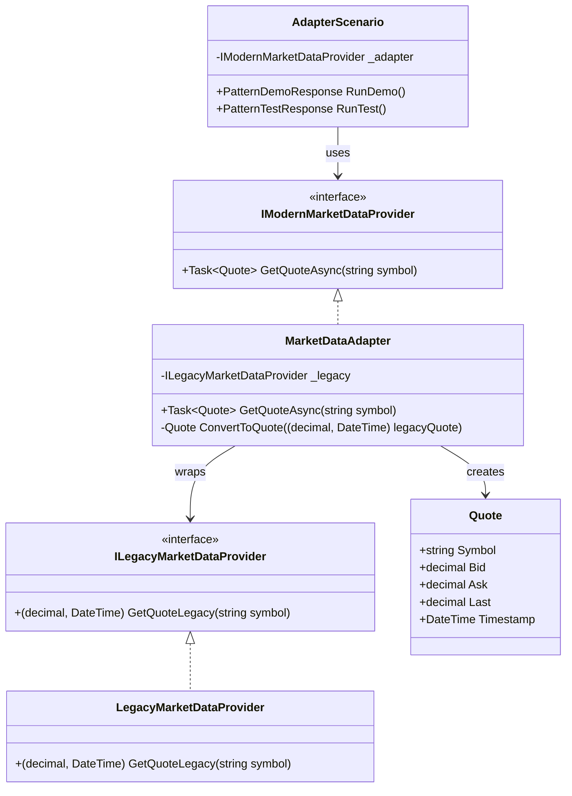

**Key Relationships:**
- `MarketDataAdapter` implements modern interface `IModernMarketDataProvider`
- Adapter wraps legacy `ILegacyMarketDataProvider`
- Converts sync methods to async, tuples to objects
- Client uses modern interface without knowing about legacy system

---

## 6. Command Pattern

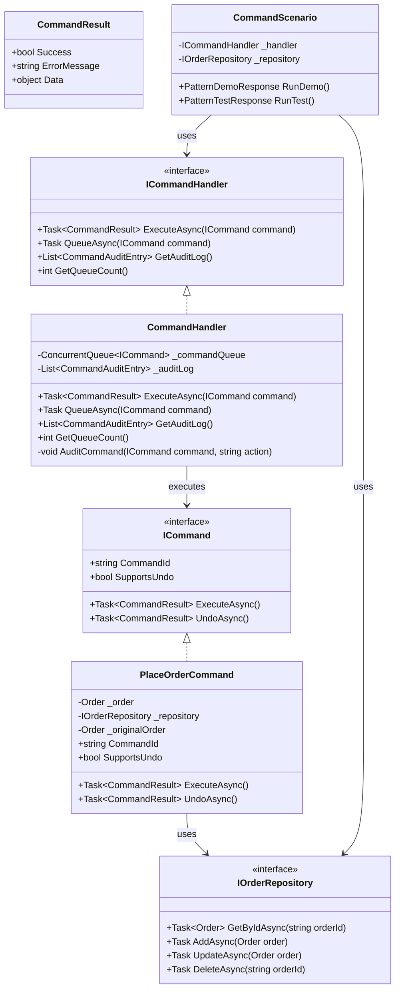

**Key Relationships:**
- `PlaceOrderCommand` implements `ICommand` and encapsulates order placement
- `CommandHandler` executes commands with retry, audit, and queue support
- Commands can be executed or queued for later processing
- Commands support undo by storing original state

---

## 7. Decorator Pattern

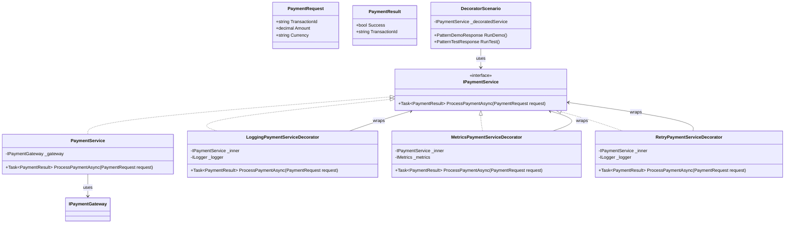

**Key Relationships:**
- All decorators implement `IPaymentService` interface
- Each decorator wraps inner `IPaymentService` (composition)
- Decorators can be chained: `Retry → Metrics → Logging → Core`
- Each decorator adds behavior before/after calling inner service

---

## 8. Strategy Pattern

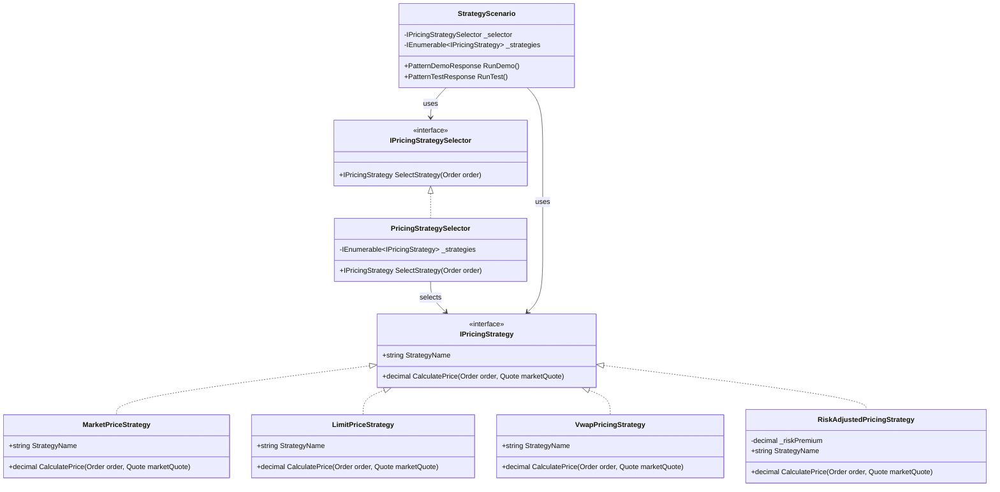

**Key Relationships:**
- All strategies implement `IPricingStrategy` interface
- `PricingStrategySelector` selects appropriate strategy based on order
- Strategies are interchangeable - can switch at runtime
- Client uses strategy interface, not concrete implementations

---

## 9. Observer Pattern

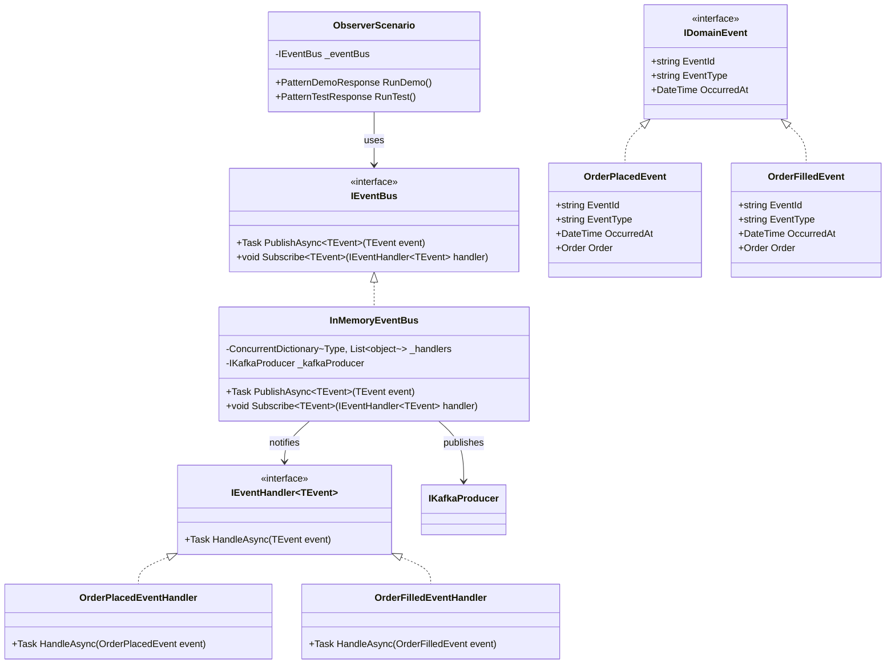

**Key Relationships:**
- `IEventBus` manages subscriptions and publishing
- Event handlers subscribe to specific event types
- When event is published, all subscribed handlers are notified
- Handlers implement `IEventHandler<TEvent>` for specific event types
- Event bus also publishes to Kafka for distributed pub-sub

---

## 10. Facade Pattern

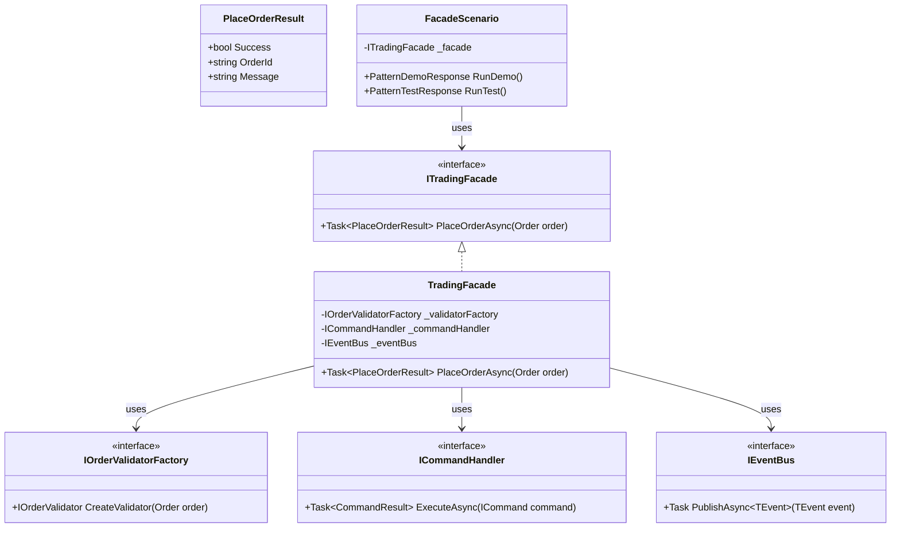

**Key Relationships:**
- `TradingFacade` provides simple interface to complex subsystem
- Facade coordinates multiple subsystems (validator, command handler, event bus)
- Client only knows about facade, not subsystems
- Facade hides complexity and simplifies API

---

## 11. Repository Pattern

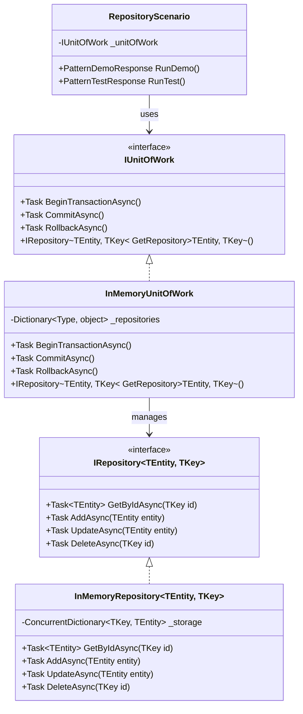

**Key Relationships:**
- `IRepository<TEntity, TKey>` abstracts data access operations
- `IUnitOfWork` coordinates multiple repositories and transactions
- Repository implementations handle persistence details
- Unit of Work ensures transactional consistency across repositories

---

## 12. Mediator Pattern

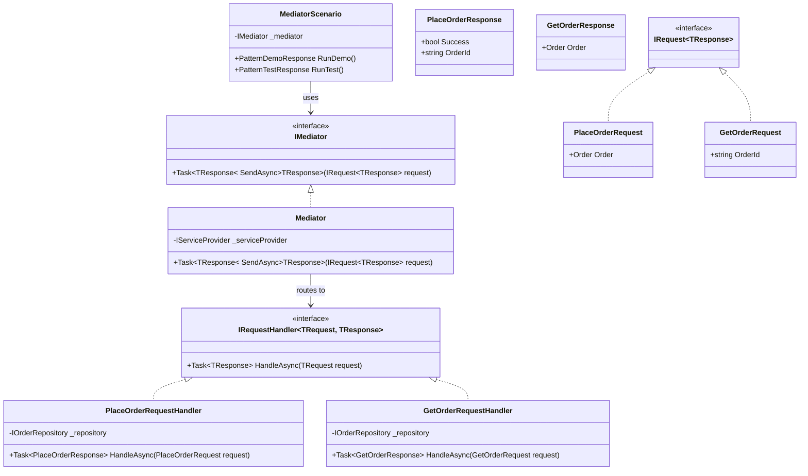

**Key Relationships:**
- `IMediator` routes requests to appropriate handlers
- Handlers implement `IRequestHandler<TRequest, TResponse>`
- Components don't know about each other - only mediator
- Mediator uses reflection to find and resolve handlers from DI

---

## 13. State Pattern

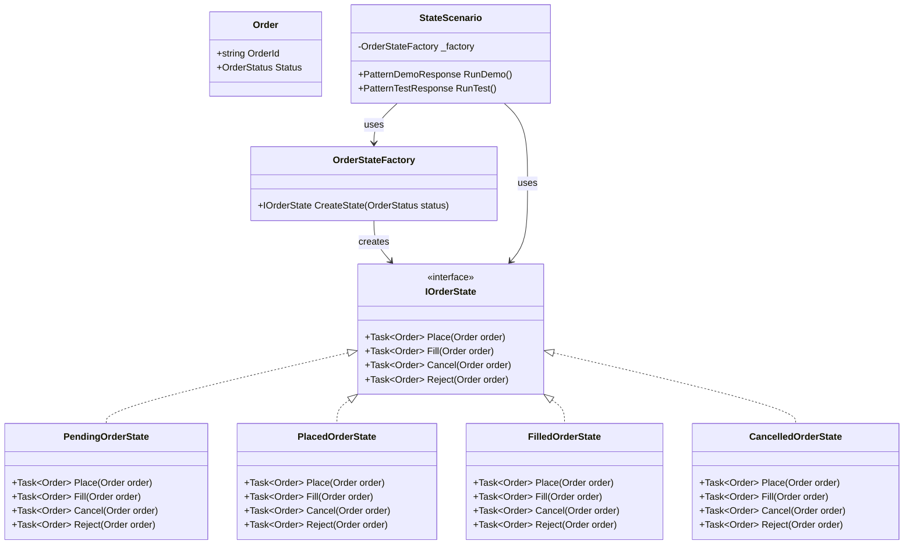

**Key Relationships:**
- Each state implements `IOrderState` with state-specific behavior
- `OrderStateFactory` creates state objects from `OrderStatus` enum
- Invalid transitions throw exceptions (enforced at compile time)
- Order delegates behavior to current state object

---

## 14. Prototype Pattern

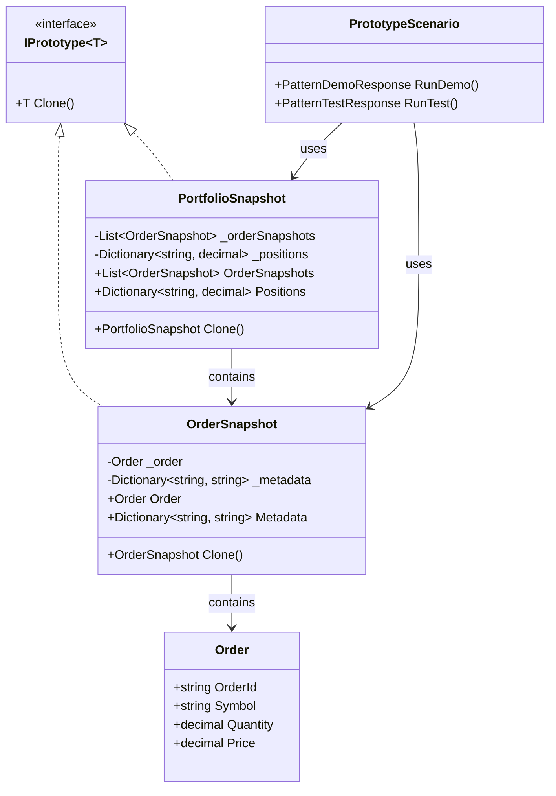

**Key Relationships:**
- Prototypes implement `Clone()` method for deep copying
- `OrderSnapshot` clones order and metadata independently
- `PortfolioSnapshot` clones list of order snapshots and positions
- Clones are independent - modifications don't affect originals

---

## 15. Chain of Responsibility Pattern

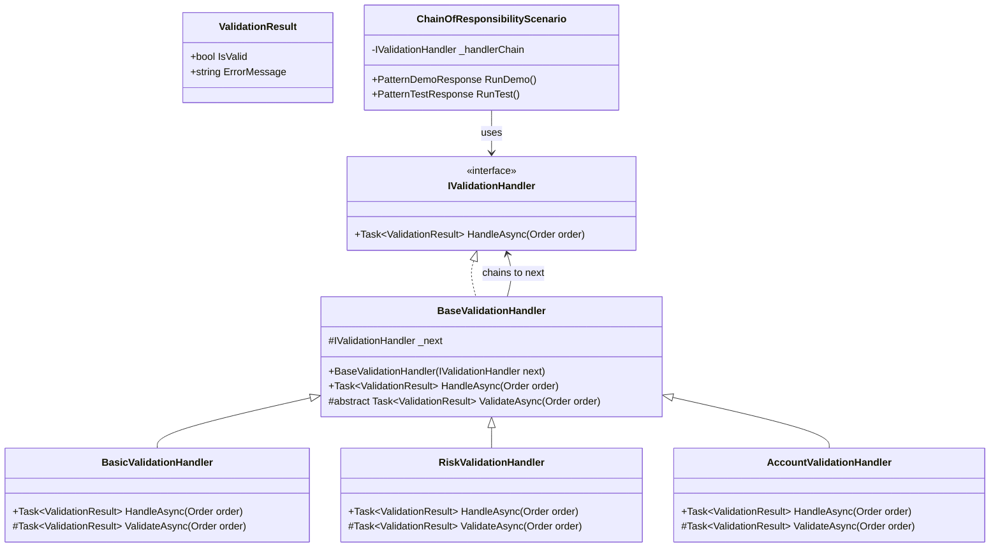

**Key Relationships:**
- `BaseValidationHandler` implements chain behavior
- Handlers are linked together (each has reference to next)
- Request flows through chain: Basic → Risk → Account
- Each handler validates and passes to next if valid

---

## 16. Strategy Advanced Pattern

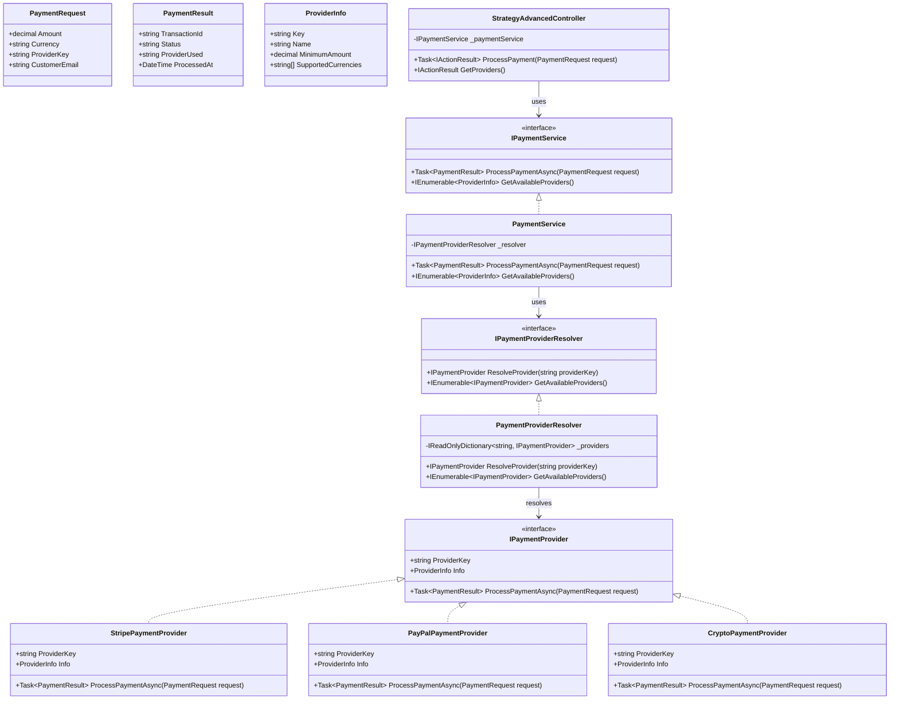

**Key Relationships:**
- All providers implement `IPaymentProvider` interface
- `PaymentProviderResolver` provides O(1) lookup by provider key
- `PaymentService` uses resolver to select provider at runtime
- Provider selection based on user input (`ProviderKey` in request)
- Resolver discovers all registered providers dynamically

---

## Legend

**Interface:** `<<interface>>`  
**Abstract Class:** `<<abstract>>` or `#abstract`  
**Composition:** `-->` (arrow with solid line)  
**Inheritance:** `<|--` (arrow with triangle)  
**Implementation:** `<|..` (dashed arrow with triangle)  
**Dependency:** `-->` (arrow with dashed line)

---

## Diagram Conventions

1. **Interfaces** are marked with `<<interface>>` stereotype
2. **Abstract classes** use `#` for protected members
3. **Composition** (has-a) uses solid arrow `-->`
4. **Inheritance** (is-a) uses triangle arrow `<|--`
5. **Implementation** uses dashed triangle `<|..`
6. **Generics** use `~` notation: `List~T~`, `IRepository~TEntity, TKey~`
7. **Collections** are shown with type parameters

---

## Using These Diagrams

These diagrams can be:
- Rendered in Markdown viewers that support Mermaid (GitHub, GitLab, VS Code)
- Exported to PNG/SVG using Mermaid Live Editor
- Used as reference for understanding pattern structure
- Shared with team members for code reviews
- Included in documentation and presentations

**Mermaid Live Editor:** https://mermaid.live/

---

*All diagrams are based on the actual implementations in this project*
*Last Updated: 2026*  
*For interview preparation and enterprise reference*  
*By Mohsin Rasheed ([LinkedIn](https://linkedin.com/in/mohsinrasheed))*

